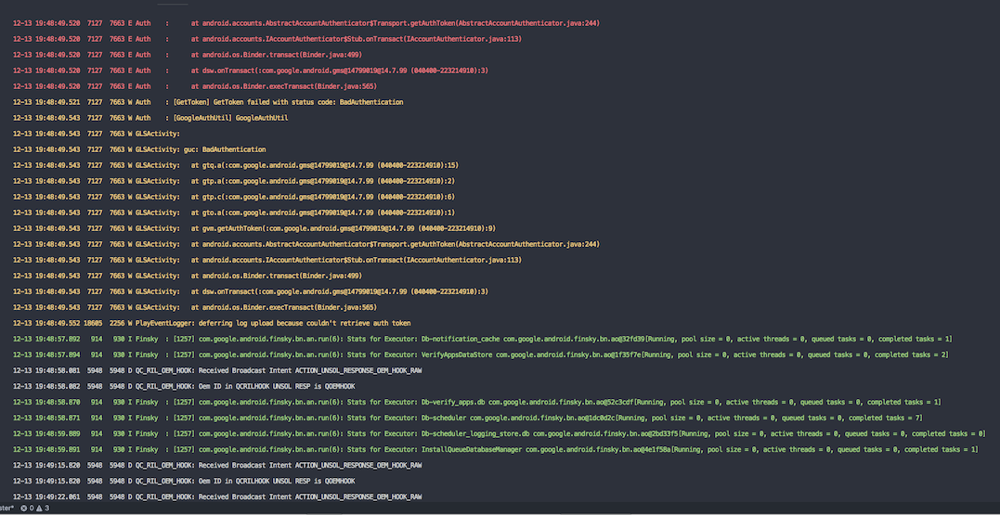

# logcrab

A simple color utility for viewing log from Android's [logcat](https://developer.android.com/studio/command-line/logcat).

## build

[Install Rust](https://www.rust-lang.org/tools/install), then

```shell

$ cd logcrab; cargo build --release
$ export PATH=$PATH:/target/release # just a convenient way of using it anywhere

```

## usage

`adb logcat | logcrab`

